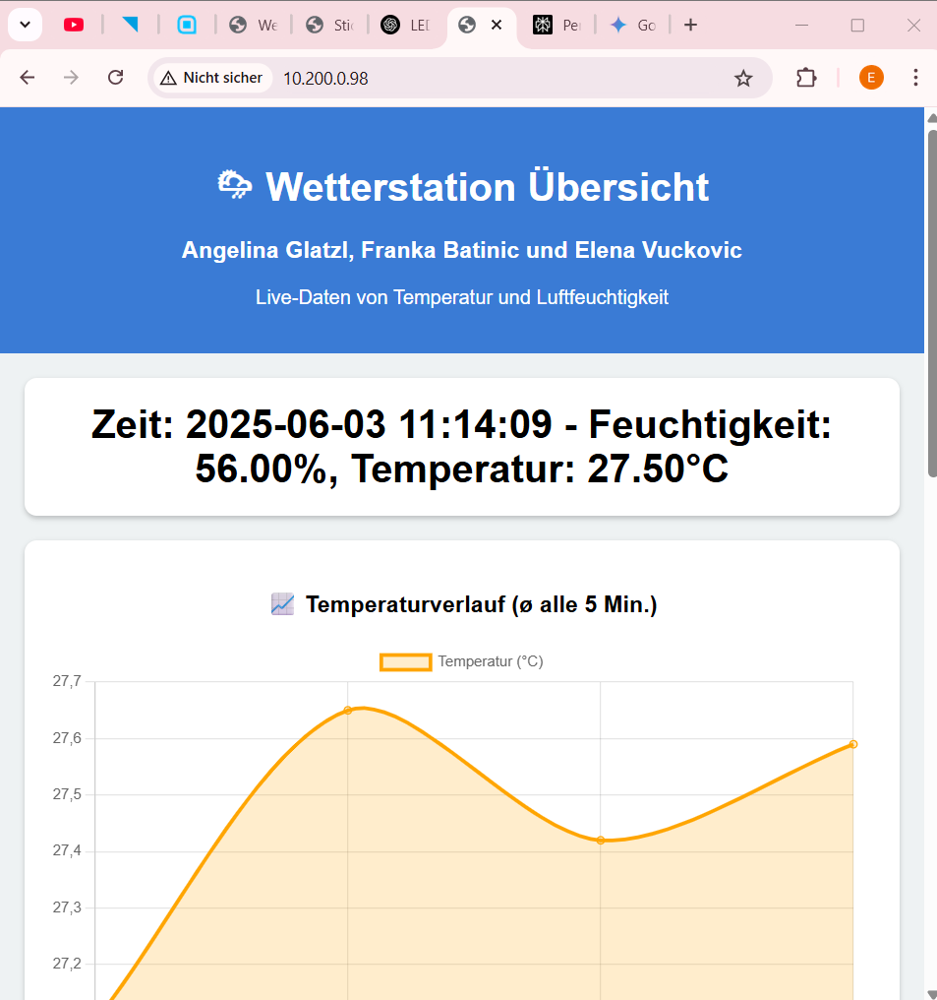
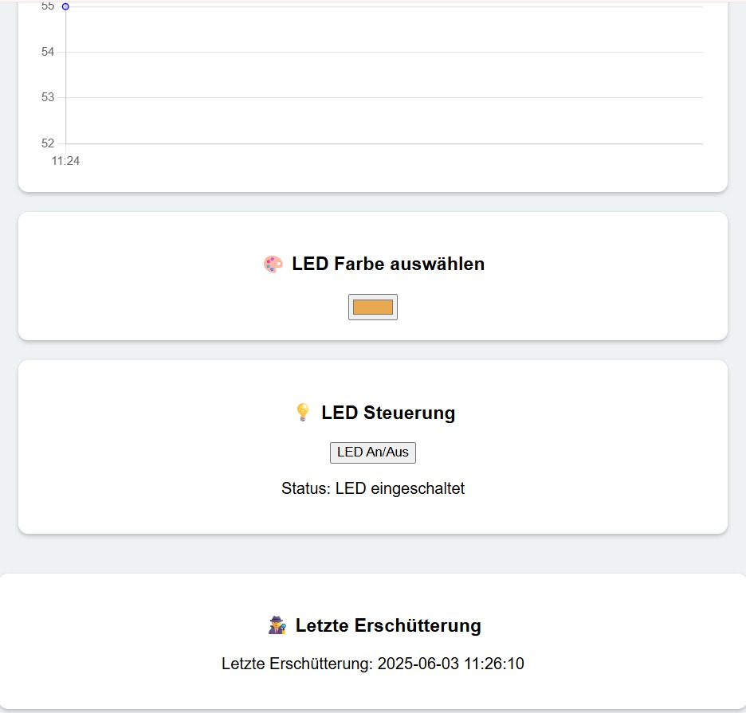

# SYT Wetterstation
Verfasser: Franka Batinic, Elena Vuckovic, Angelina Glatzl  
Datum: **03.06.2025**

## 1.  Einführung
Im Zuge des Systemtechnik- und ITP-Unterrichts wurde eine Wetterstation gebaut. Die Funktionen wurden durch die Gruppeneinteilung bestimmt. Zentral war hierfür die Verwendung des Mikrocontrollers ESP32C3 Dev Module, welcher die Realisierung ermöglichte. 

## 2.  Projektbeschreibung
Es wurde ein kompaktes System entwickelt, das mithilfe eines DHT11-Sensors in regelmäßigen Abständen Temperatur und Luftfeuchtigkeit misst. Die erfassten Daten werden über die serielle Schnittstelle ausgegeben und in einem Graphen zusammengefasst. Zusätzlich gibt es einen Sensor, der Erschütterungen wahrnimmt. Außerdem wurde ein Discord-Bot integriert, der auf Anfrage die aktuellen Messdaten übermittelt.
#### GK:
- WLAN Verbindung ermöglichen
- Messungen:
  - Temperatur
  - Luftfeuchtigkeit
  - Erschütterung
- Graph zu den einzelnen Messwerten
- Website
#### EK:
- LED-Steuerung durch:
  - RGB-Colour-Picker
  - Manuelle An-/Ausschaltung

## 3.  Theorie
Eine Wetterstation misst Umweltbedingungen wie Temperatur, Luftfeuchtigkeit oder Erschütterungen mithilfe spezieller Sensoren. Der DHT11-Sensor erfasst Temperatur und Luftfeuchtigkeit - der B23-Schocksensor erkennt Erschütterungen und gibt bei Bewegung ein digitales Signal aus. Die Messwerte werden regelmäßig erfasst, bereinigt (z. B. Ausreißer entfernt, Durchschnitt berechnet) und mit einem Zeitstempel versehen. Über WLAN stellt der Mikrocontroller die Daten auf einer Webseite dar, sodass sie einfach im Browser abgerufen werden können.


## 4.   Arbeitsschritt
#### a) Informieren
Unser erster Schritt war, die Datenblätter des Mikrocontrollers und der Sensoren anzusehen, um eine ungefähre Idde zu haben, wie wir diese für die Wetterstation einsetzen können. 
#### b) Schaltung
Der zweite Schritt war die Schaltung. Nachdem wir wussten, wie die einzelnen Bestandteile funktionieren, haben wir diese sinnvoll miteinander verbunden.
#### c) Code
Nun haben wir einen Code geschrieben, mit dem wir die Funktionalitäten der Sensoren nutzen und die Aufgabenstellung erfüllen können.

## 5. Bilder und Schaltungen
  
  
  
  
  
  
  

    

## 6. Code
<pre>```cpp
#include <WiFi.h>
#include <WebServer.h>
#include <DHT.h>
#include <time.h>
#include <Adafruit_NeoPixel.h>
#include <HTTPClient.h>

// ==== Pin-Definitionen ====
#define DHTPIN 2
#define DHTTYPE DHT11
#define LED_PIN 8
#define NUMPIXELS 1
#define sensorPin 19

// ==== WLAN-Zugangsdaten ====
const char* ssid = "IOT";
const char* password = "20tgmiot18";


// ==== Initialisierungen ====
Adafruit_NeoPixel pixel(NUMPIXELS, LED_PIN, NEO_GRB + NEO_KHZ800);
DHT dht(DHTPIN, DHTTYPE);
WebServer server(80);

// ==== Zustände ====
bool ledState = true;
bool shakeDetected = false;
unsigned long lastShake = 0;
unsigned long shakeCooldown = 5000;
String lastShakeLog = "Noch keine Erschütterung erkannt."; // Name der Variable angepasst

String lastMeasurement = "";
unsigned long lastRead = 0;
const unsigned long interval = 20000;

const int maxDataPoints = 12;
String timestamps[maxDataPoints];
float avgTemperatures[maxDataPoints];
float avgHumidities[maxDataPoints];
int dataIndex = 0;

float tempSum = 0;
float humSum = 0;
int readingsCount = 0;
unsigned long lastAverageTime = 0;

const int lastMeasuresSize = 5;
float lastTemps[lastMeasuresSize] = {0};
float lastHums[lastMeasuresSize] = {0};
int filterIndex = 0;
bool filterFilled = false;

uint8_t ledColor[3] = {0, 0, 0}; // RGB Farbe der LED, initial schwarz (aus)
bool manualColorMode = false;


// ==== Hilfsfunktionen ====
void setLEDColor(uint8_t r, uint8_t g, uint8_t b) {
  ledColor[0] = r;
  ledColor[1] = g;
  ledColor[2] = b;
  setLED(r, g, b);
}

void initTime() {
  // Aktuelle Zeitzone: CET-1CEST,M3.5.0/2,M10.5.0/3 (Central European Time mit Sommerzeit)
  configTzTime("CET-1CEST,M3.5.0/2,M10.5.0/3", "pool.ntp.org", "time.nist.gov");
  while (time(nullptr) < 100000) delay(500); // Warten, bis die Uhrzeit synchronisiert ist
}

void setLED(uint8_t r, uint8_t g, uint8_t b) {
  pixel.setPixelColor(0, pixel.Color(r, g, b));
  pixel.show();
}

String getFormattedTime() {
  time_t now = time(nullptr);
  struct tm* timeinfo = localtime(&now);
  char buffer[25];
  strftime(buffer, sizeof(buffer), "%Y-%m-%d %H:%M:%S", timeinfo);
  return String(buffer);
}

bool isOutlier(float newValue, float* history, int size, float tolerance = 8.0) {
  int count = filterFilled ? size : filterIndex;
  if (count == 0) return false;
  float sum = 0;
  for (int i = 0; i < count; i++) sum += history[i];
  float avg = sum / count;
  return abs(newValue - avg) > tolerance;
}

void setup() {
  Serial.begin(115200);
  pixel.begin(); // NeoPixel Initialisierung einmalig im Setup
  setLED(255, 0, 255); // Initialfarbe beim Start (z.B. Magenta)

  dht.begin();
  pinMode(sensorPin, INPUT);

  WiFi.begin(ssid, password);
  while (WiFi.status() != WL_CONNECTED) {
    delay(500);
    Serial.print(".");
  }
  setLED(0, 0, 0); // Nach erfolgreicher WLAN-Verbindung LED ausschalten
  Serial.println("\nWLAN verbunden!");
  Serial.println(WiFi.localIP());

  initTime();

  // ==== Webserver-Routen ====
  server.on("/", []() {
    server.send(200, "text/html", R"rawliteral(
      <!DOCTYPE html>
      <html lang="de">
      <head>
        <meta charset="UTF-8">
        <meta name="viewport" content="width=device-width, initial-scale=1.0">
        <title>Wetterstation Übersicht</title>
        <script src="https://cdn.jsdelivr.net/npm/chart.js"></script>
        <style>
          body { font-family: Arial; background: #eef2f3; margin: 0; padding: 0; }
          header { background-color: #3a7bd5; color: white; padding: 20px; text-align: center; }
          main { padding: 20px; }
          .data-box { background-color: white; border-radius: 10px; padding: 20px; box-shadow: 0 2px 4px rgba(0,0,0,0.2); margin-bottom: 20px; text-align: center; }
          .data-box h2 { margin: 0; font-size: 2em; }
          canvas { max-width: 100%; margin-top: 20px; }
        </style>
      </head>
      <body>
        <header>
          <h1>🌦 Wetterstation Übersicht</h1>
          <h3>Angelina Glatzl, Franka Batinic und Elena Vuckovic</h3>
          <p>Live-Daten von Temperatur und Luftfeuchtigkeit</p>
        </header>
        <main>
          <div class="data-box"><h2 id="currentData">Lade aktuelle Messung...</h2></div>
          <div class="data-box"><h3>📈 Temperaturverlauf (ø alle 5 Min.)</h3><canvas id="tempChart"></canvas></div>
          <div class="data-box"><h3>💧 Luftfeuchtigkeitsverlauf (ø alle 5 Min.)</h3><canvas id="humChart"></canvas></div>
          <div class="data-box"><h3>🎨 LED Farbe auswählen</h3><input type="color" id="ledColor" value="#000000"></div>
          <div class="data-box">
            <h3>💡 LED Steuerung</h3>
            <button id="toggleLedButton">LED An/Aus</button>
            <p id="ledStatusText">Status: unbekannt</p>
          </div>
        </main>
        <div class="data-box"><h3>🕵 Letzte Erschütterung</h3><p id="logData">Lade Erschütterungsdaten...</p></div>
        <script>
          async function fetchCurrentData() {
            const res = await fetch("/data");
            const text = await res.text();
            document.getElementById("currentData").textContent = text;
          }
          async function fetchChartData(url) {
            const res = await fetch(url);
            const text = await res.text();
            const lines = text.trim().split("\n");
            const labels = [], data = [];
            lines.forEach(line => {
              const [time, value] = line.split(",");
              labels.push(time.slice(11, 16));
              data.push(parseFloat(value));
            });
            return { labels, data };
          }
          async function drawCharts() {
            const tempData = await fetchChartData("/chartdata");
            const humData = await fetchChartData("/humiditychartdata");
            new Chart(document.getElementById('tempChart').getContext('2d'), {
              type: 'line',
              data: {
                labels: tempData.labels,
                datasets: [{
                  label: 'Temperatur (°C)',
                  data: tempData.data,
                  borderColor: 'orange',
                  backgroundColor: 'rgba(255,165,0,0.2)',
                  tension: 0.3,
                  fill: true
                }]
              }
            });
            new Chart(document.getElementById('humChart').getContext('2d'), {
              type: 'line',
              data: {
                labels: humData.labels,
                datasets: [{
                  label: 'Luftfeuchtigkeit (%)',
                  data: humData.data,
                  borderColor: 'blue',
                  backgroundColor: 'rgba(0,0,255,0.1)',
                  tension: 0.3,
                  fill: true
                }]
              }
            });
          }
          // Initialer Datenabruf und Chart-Zeichnung
          fetchCurrentData();
          drawCharts();

          async function fetchLogData() {
            const res = await fetch("/logbuch"); // Ruft Daten von der '/logbuch' Route ab
            const text = await res.text();
            document.getElementById("logData").textContent = text;
          }
          fetchLogData(); // Initialer Abruf für Erschütterungsdaten

          function hexToRgb(hex) {
            const bigint = parseInt(hex.slice(1), 16);
            return { r: (bigint >> 16) & 255, g: (bigint >> 8) & 255, b: bigint & 255 };
          }

          // Event-Listener für den Colorpicker
          document.getElementById("ledColor").addEventListener("input", function () {
            const { r, g, b } = hexToRgb(this.value);
            fetch(/setcolor?r=${r}&g=${g}&b=${b}, { method: "GET" });
          });

          // Funktion zum Setzen der initialen Farbe des Colorpickers
          function setInitialColor() {
            fetch("/getcolor")
              .then(res => res.json())
              .then(data => {
                const hex = "#" + data.r.toString(16).padStart(2, '0') +
                                     data.g.toString(16).padStart(2, '0') +
                                     data.b.toString(16).padStart(2, '0');
                document.getElementById("ledColor").value = hex;
              });
          }

          // Wird nach dem Laden der Seite ausgeführt
          window.onload = () => {
            fetchCurrentData();
            drawCharts();
            setInitialColor(); // Setzt die Farbe des Colorpickers basierend auf dem Mikrocontroller
            // Aktualisiert Daten alle paar Sekunden
            setInterval(fetchCurrentData, 5000);
            setInterval(fetchLogData, 2000); // Aktualisiert Erschütterungsdaten alle 2 Sekunden
          };

          // Event-Listener für den LED An/Aus Button
          document.getElementById("toggleLedButton").addEventListener("click", async function () {
            const res = await fetch("/toggleLED");
            const statusText = await res.text();
            document.getElementById("ledStatusText").textContent = "Status: " + statusText;
          });

        </script>
      </body>
      </html>
    )rawliteral");
  });

  server.on("/data", []() {
    server.send(200, "text/plain", lastMeasurement);
  });

  server.on("/toggleLED", []() {
    ledState = !ledState;
    if (ledState) {
      // Wenn der manuelle Modus aktiv ist, soll die zuletzt gesetzte Farbe beibehalten werden,
      // ansonsten auf eine Standardfarbe (z.B. Grün) zurückfallen.
      if (manualColorMode) {
        setLEDColor(ledColor[0], ledColor[1], ledColor[2]);
      } else {
        setLED(0, 255, 0); // Standardfarbe Grün, wenn nicht im manuellen Modus
      }
    } else {
      setLED(0, 0, 0); // LED ausschalten
    }
    server.send(200, "text/plain", ledState ? "LED eingeschaltet" : "LED ausgeschaltet");
  });

  server.on("/chartdata", []() {
    String data = "";
    for (int i = 0; i < maxDataPoints; i++) {
      int index = (dataIndex + i) % maxDataPoints;
      if (timestamps[index] != "") {
        data += timestamps[index] + "," + String(avgTemperatures[index], 2) + "\n";
      }
    }
    server.send(200, "text/plain", data);
  });

  server.on("/humiditychartdata", []() {
    String data = "";
    for (int i = 0; i < maxDataPoints; i++) {
      int index = (dataIndex + i) % maxDataPoints;
      if (timestamps[index] != "") {
        data += timestamps[index] + "," + String(avgHumidities[index], 2) + "\n";
      }
    }
    server.send(200, "text/plain", data);
  });

  // Angepasste Route für die letzte Erschütterung
  server.on("/logbuch", []() { // Route bleibt gleich, Inhalt ändert sich
    server.send(200, "text/plain", lastShakeLog); // sendet den Inhalt von lastShakeLog
  });

  // Routen für Farbsteuerung müssen im setup() sein
  server.on("/setcolor", []() {
    if (server.hasArg("r") && server.hasArg("g") && server.hasArg("b")) {
      uint8_t r = server.arg("r").toInt();
      uint8_t g = server.arg("g").toInt();
      uint8_t b = server.arg("b").toInt();
      manualColorMode = true; // Manuellen Modus aktivieren
      ledState = true;        // LED einschalten, wenn eine Farbe gesetzt wird
      setLEDColor(r, g, b);
      server.send(200, "text/plain", "OK");
    } else {
      server.send(400, "text/plain", "Fehlende Parameter");
    }
  });

  server.on("/getcolor", []() {
    String json = "{";
    json += "\"r\":" + String(ledColor[0]) + ",";
    json += "\"g\":" + String(ledColor[1]) + ",";
    json += "\"b\":" + String(ledColor[2]) + "}";
    server.send(200, "application/json", json);
  });

  server.begin(); // Startet den Webserver
}

void loop() {
  server.handleClient(); // Muss immer aufgerufen werden, um Anfragen zu verarbeiten

  int sensorValue = digitalRead(sensorPin);
  if (sensorValue == HIGH && millis() - lastShake > shakeCooldown) {
    Serial.println("💥 Erschütterung erkannt!");
    shakeDetected = true;
    lastShake = millis();

    String currentTime = getFormattedTime(); // Holt den aktuellen Zeitstempel
    lastShakeLog = "Letzte Erschütterung: " + currentTime; // Aktualisiert die Variable für die Webseite
    Serial.println(lastShakeLog); // Ausgabe im Serial Monitor für Debugging

    // Blinkt nur, wenn LED an ist und nicht im manuellen Farbmodus
    if (ledState && !manualColorMode) {
      setLED(255, 0, 255); // Kurzes Blinken in Magenta
      delay(500);
      // Nach dem Blinken die ursprüngliche, temperaturabhängige Farbe wiederherstellen
      // Hier muss die Logik für die temperaturabhängige Farbe erneut ausgeführt werden
      // um den korrekten Zustand wiederherzustellen, wenn manualColorMode false ist.
      // Eine einfachere Lösung ist, die Temperatur erneut zu prüfen:
      float currentTemperature = dht.readTemperature();
      if (!isnan(currentTemperature)) {
        if (currentTemperature > 30) setLED(255, 165, 0);     // orange
        else if (currentTemperature >= 17.0) setLED(0, 255, 0);  // grün
        else setLED(0, 0, 255);                     // blau
      } else {
        // Falls DHT-Lesung fehlschlägt, auf Standard-Aus-Zustand zurückfallen
        setLED(0, 0, 0);
      }
    } else if (ledState && manualColorMode) {
      // Wenn manueller Modus aktiv, nach Blinken die manuell gesetzte Farbe wiederherstellen
      setLEDColor(ledColor[0], ledColor[1], ledColor[2]);
    }
  }

  // Temperatur- und Feuchtigkeitsmessung
  if (lastRead == 0 || millis() - lastRead >= interval) {
    lastRead = millis();

    float humidity = dht.readHumidity();
    float temperature = dht.readTemperature();

    if (!isnan(humidity) && !isnan(temperature)) {
      if (isOutlier(temperature, lastTemps, lastMeasuresSize) || isOutlier(humidity, lastHums, lastMeasuresSize)) {
        Serial.println("⚠ Ausreißer ignoriert.");
        return; // Verhindert die Verarbeitung von Ausreißern
      }

      lastTemps[filterIndex] = temperature;
      lastHums[filterIndex] = humidity;
      filterIndex = (filterIndex + 1) % lastMeasuresSize;
      if (filterIndex == 0) filterFilled = true;

      String time = getFormattedTime();
      lastMeasurement = "Zeit: " + time + " - Feuchtigkeit: " + String(humidity, 2) + "%" + ", Temperatur: " + String(temperature, 2) + "°C";
      Serial.println(lastMeasurement);

      tempSum += temperature;
      humSum += humidity;
      readingsCount++;

      // Die Temperatur-basierte LED-Steuerung nur ausführen, wenn nicht im manuellen Farbmodus
      if (ledState && !manualColorMode) {
        if (temperature > 30) setLED(255, 165, 0);     // orange
        else if (temperature >= 17.0) setLED(0, 255, 0);  // grün
        else setLED(0, 0, 255);                     // blau
      }

      if (millis() - lastAverageTime >= 300000 || lastAverageTime == 0) { // Alle 5 Minuten (300000 ms) Durchschnitt berechnen
        avgTemperatures[dataIndex] = tempSum / readingsCount;
        avgHumidities[dataIndex] = humSum / readingsCount;
        timestamps[dataIndex] = time;
        dataIndex = (dataIndex + 1) % maxDataPoints;
        tempSum = 0;
        humSum = 0;
        readingsCount = 0;
        lastAverageTime = millis();
      }
    } else {
      Serial.println("❌ Fehler beim Lesen vom DHT11");
    }
  }
}```</pre>

## 7.  Zusammenfassung
Die Wetterstation misst Temperatur, Luftfeuchtigkeit und Erschütterungen mit Sensoren und bereitet die Daten bereinigt auf. Über WLAN stellt sie die aktuellen Messwerte auf einer einfachen Webseite grafisch dar.  
Das größte Problem war der Code, da wir uns die Programmiersprache selbst beibringen mussten und oft AI um Hilfe bitten mussten, wenn es sowohl zu Kompilierfehlern, als auch zu Logikfehlern kam.  
Unsere Klassenkameraden waren auch eine große Hilfestellung.

## 6. Quellen
[ W3Schools](https://www.w3schools.com/js/js_graphics_chartjs.asp)  
[DHT11 Humidity & Temperature Sensor Datneblatt](https://www.mouser.com/datasheet/2/758/DHT11-Technical-Data-Sheet-Translated-Version-1143054.pdf?srsltid=AfmBOoqPCNak94LpvzB-ri8S4-YdEU9O6y3Oz7485Y2GzXr8UpFO9wqf)  
[Erschütterungssensor B-231Datenblatt](https://www.alldatasheet.com/view.jsp?Searchword=B-231&sField=2)  
[ChatGPT](https://chatgpt.com/)  
[Perplexity](https://www.perplexity.ai/)  
